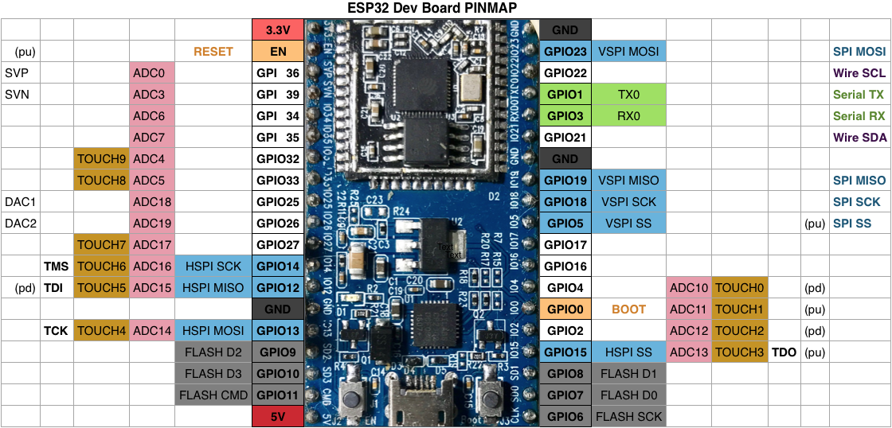

#  LED & Sensor Server 
A simple ESP32 based WEBServer providing a demonstration interface to a couple of environmental sensors.

## Pinout

## Sensoren
Es stehen folgende Sensoren zur verfügung:

- MiCS-6814 Gassensor als i2c [Grove-Module](https://www.seeedstudio.com/Grove-Multichannel-Gas-Sensor-p-2502.html) von [Seeedstudio](https://www.seeedstudio.com/)
	- misst NO2, CO und CH3
- BMP280 als i2c [Modul](http://sensorkit.joy-it.net/index.php?title=KY-052_Drucksensor_/_Temperatursensor_-_BMP280_-) von [Joy-it](https://www.joy-it.net) 
	- Druck und Temperatur 
- DHT11 als oneWire [Modul](http://sensorkit.joy-it.net/index.php?title=KY-015_Kombi-Sensor_Temperatur%2BFeuchtigkeit) von [Joy-it](https://www.joy-it.net)  
	- Temperatur und Feuchtigkeit
- SDS011 serielles [Modul](https://www.watterott.com/de/Nova-SDS011-Feinstaub-Sensor) von [Watterott](https://www.watterott.com)
	- Partikelkonzetration in PM10 und PM2,5

### Used Pins
PIN | Function | use         | Status
:--:|----------|-------------|:------:
27  | PWM		  |LED blue     | ✓
32  | PWM		  |LED red      | ✓
33  | PWM    	  |LED green    | ✓
 |
22  | i2c  	  |  NOX Sensor | planed
21  | i2c      |  NOX Sensor | planed
|
|17 | U2TXD	  | Staub Sensor| planed
|16 | U2RXD    | Staub Sensor| planed
|14 | oneWire  | DHT11			| planed

